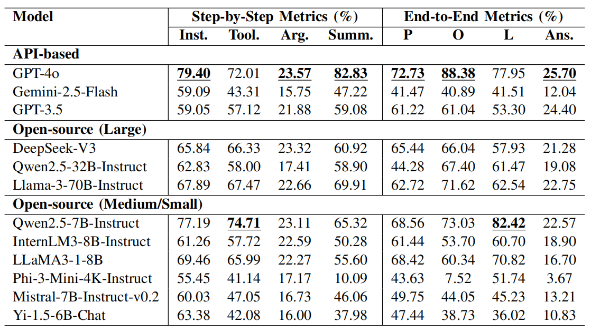
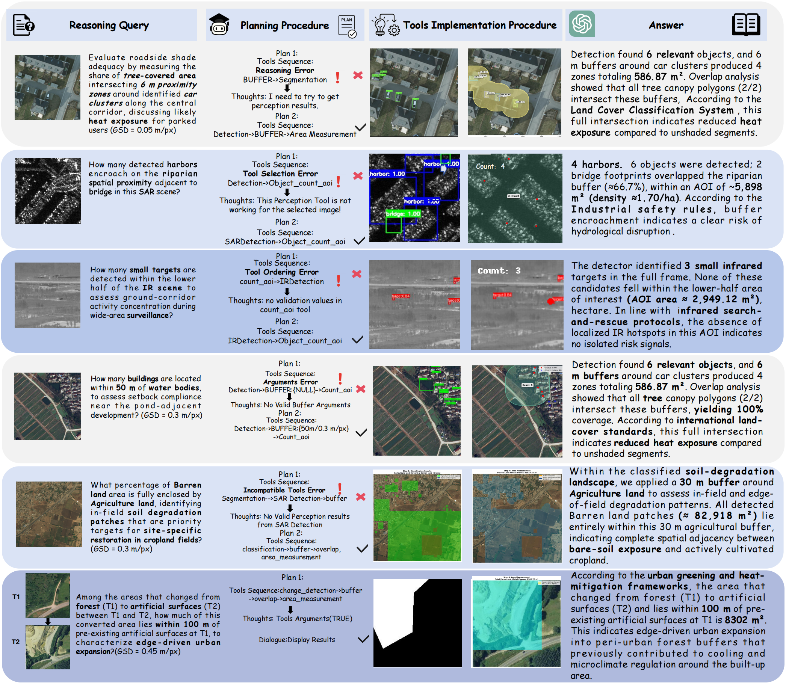

# Resilient Multimodal Geospatial Reasoning with Tool-Augmented Remote Sensing Agents

  <a href="https://github.com/Ireliya/Resilient-Multimodal-Geospatial-Reasoning-with-Tool-Augmented-Remote-Sensing-Agents">Project</a> •

  

---

## Contents
- [Introduction](#introduction)
- [Contributions](#core-contributions)
- [Results](#results)
- [Examples](#qualitative-examples)
---

## Introduction
This repository hosts the project page and supporting materials for our work on resilient multimodal geospatial reasoning.
with **tool-augmented remote sensing agents**. The agent is designed to support **verifiable, multi-step geospatial workflows**
across **Optical / SAR / IR** modalities, where a query must be decomposed into executable tool chains (e.g., perception → spatial relations → spatial statistics)
and the final answer is synthesized from tool outputs.

---

## Contributions
- **Multimodal geospatial reasoning benchmark design** targeting cognitive-level, scenario-driven tasks that require compositional reasoning and long-horizon planning.
- **Tool-augmented agent framework** with semantic tool retrieval, abstract plan generation, and constraint-aware execution (typed I/O, unit and validity checks).
- **Error-aware replanning** via tool substitution within compatible toolkits and prefix-preserving plan repair to improve robustness.
- **Verifiable answer synthesis**, where all scalar results (count/area/distance/ratio) are produced by tools and then summarized into natural language.

---

## Results
We evaluate a diverse set of API-based and open-source LLMs using unified step-wise and end-to-end metrics.

  

---

## Examples
Representative examples illustrating multi-step reasoning, tool execution, and answer synthesis, as well as common failure modes.

  

---

This repository will be updated with download links and documentation at that time.
